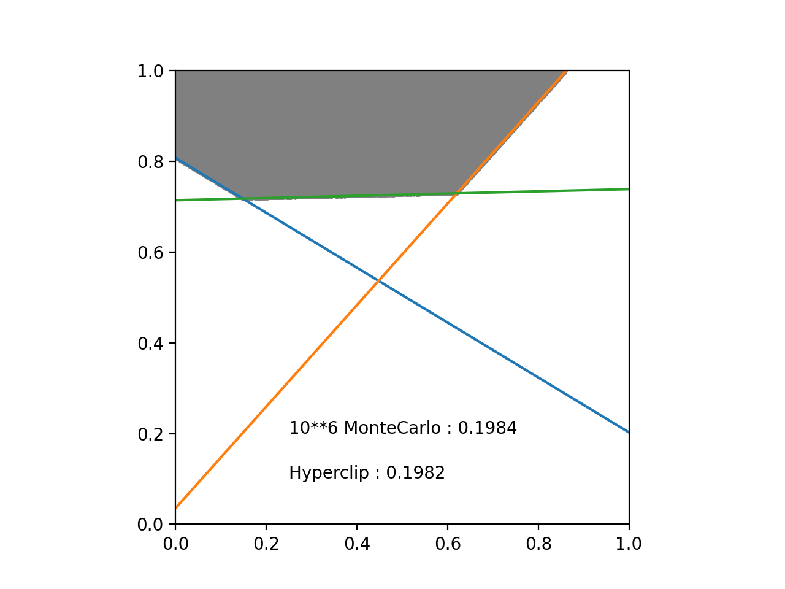

# hyperclip

This Python 3.5+ package implements volume computation of hypercubes clipped by hyperplanes.
All methods implemented here have been proposed by Yunhi Cho and Seonhwa Kim (2020) in the article [Volume of Hypercubes Clipped by Hyperplanes and Combinatorial Identities](https://doi.org/10.13001/ela.2020.5085). An arxiv paper is available [here](https://arxiv.org/pdf/1512.07768.pdf).
The documentation is available on [Read the Doc](https://hyperclip.readthedocs.io/en/latest/).

## Installation

Hyperclip is available through [PyPI](https://pypi.org/project/hyperclip/), and may be installed using `pip` :
   
    pip install hyperclip

## Introduction

The package is essentially composed by two classes : :class:`~hyperclip.Hyperplane` and :class:`~hyperclip.Hyperclip`.

* `hyperclip.Hyperplane` allows users to create a n-dimensional hyperplane defined as `a.x + r \geq 0`. It is possible to directly set `a` and `r` or to provide `n` distinct points which belongs to the hyperplane, i.e `a.x + r = 0`.
* `hyperclip.Hyperclip` allows users to create an hyperclip object. It aims to compute the volume of `A.X+R \leq 0` for `X` inside the uniform hypercube `[0,1]^n`. It is possible to directly set `A` and `R` or to set a list of `hyperclip.Hyperplane` objects.

## Example code

Here's an example showing the usage of `hyperclip.Hyperclip` for a 2-dimensional case.
The result provided by Hyperclip is compared to a MonteCarlo volume estimation.

```python
import numpy as np
import hyperclip
from matplotlib import pyplot as plt

n = 2
m = 3

np.random.seed(29)
hyperplanes = [hyperclip.Hyperplane().set_by_points(np.random.random((n,n))) for i_m in range(m)]
np.random.seed(None)

X = np.random.random((10**6,n))

id_pos_side = np.ones(X.shape[0])
for hyp in hyperplanes:
    id_pos_side = np.all((id_pos_side, hyp.side(X)), axis=0)

fig, axs = plt.subplots()
axs.set_aspect('equal', 'box')
plt.scatter(X[id_pos_side, 0], X[id_pos_side, 1], s=2, color='gray')

for hyp in hyperplanes:
    sol = hyp.compute_n_solutions()
    x_a, y_a, x_b, y_b = sol.flat
    
    a = (y_b-y_a)/(x_b-x_a)
    b = y_a - x_a * a
    
    y_0 = b
    y_1 = a * 1 + b
    
    plt.plot([0, 1], [y_0, y_1])   

hc = hyperclip.Hyperclip().set_hyperplanes(hyperplanes)

vol = hc.volume()

plt.text(0.25,0.2, "10**6 MonteCarlo : "+str(round(id_pos_side.mean(),4)))
plt.text(0.25,0.1, "Hyperclip : "+str(round(vol,4)))

plt.xlim([0,1])
plt.ylim([0,1])
plt.show()
```



## Contact

Please, send me an email at [francois-remi.mazy@inria.fr](mailto:francois-remi.mazy@inria.fr).